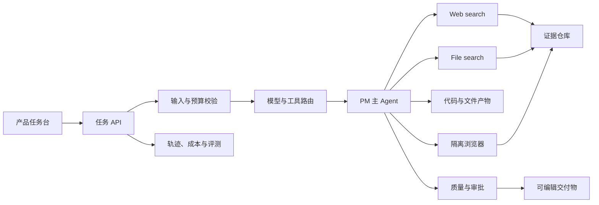

# 产品经理 Agent 系统架构

版本：0.1  
更新日期：2026-08-16

## 1. 技术决策

- 前后端：Next.js + TypeScript。
- Agent 运行时：OpenAI Agents SDK。
- 模型与工具底座：Responses API。
- 输入输出约束：Zod 与 Structured Outputs。
- 首版编排：单主 Agent，不启用多 Agent handoff。
- 运行状态：MVP 使用请求级状态，后续迁移到持久化任务状态机。

## 2. 总体结构



## 3. 组件职责

### Web 工作台

- 收集任务、背景、深度、自治级别和预算。
- 显示执行阶段、模型、成本状态、引用和结果。
- 高风险操作通过独立审批界面处理。

### 任务 API

- 服务端读取 API Key。
- 校验请求并生成任务 ID。
- 选择模型、工具与最大轮次。
- 在无 Key 时返回明确的演示结果。

### 模型路由

| 深度 | 默认模型 | 典型任务 |
| --- | --- | --- |
| 快速 | `gpt-5.6-luna` | 分类、整理、提纲、格式转换 |
| 标准 | `gpt-5.6-terra` | 市场、竞品、PRD、用户洞察 |
| 深度 | `gpt-5.6-sol` | 高复杂度研究、关键决策审查 |

模型名通过环境变量覆盖。生产环境固定模型 ID，不依赖无后缀别名。

### PM 主 Agent

- 统一理解任务并保持用户可见的回复所有权。
- 根据工作流选择研究、分析或产物工具。
- 区分事实、推断与建议。
- 缺少关键证据时降低结论强度，而不是编造。

## 4. 请求生命周期

1. 校验输入和预算。
2. 根据执行深度选择模型和最大轮次。
3. 研究任务挂载 Web search，PRD 任务按需使用。
4. Agent 完成工具循环。
5. 服务端提取输出、引用、工具记录和使用量。
6. 输出护栏检查引用、敏感内容和结构完整性。
7. 保存轨迹并向 UI 返回结果。

## 5. 工具策略

| 工具 | 使用场景 | 风险等级 | 默认审批 |
| --- | --- | --- | --- |
| Web search | 外部事实与趋势 | 低 | 否 |
| File search | 内部知识库 | 中 | 首次授权 |
| Code interpreter | 数据与文件处理 | 中 | 否，隔离执行 |
| Computer use | 竞品体验 | 中至高 | 敏感步骤需要 |
| 外部写入连接器 | 创建或修改第三方数据 | 高 | 是 |

工具权限在服务端强制执行，不能只依赖提示词。

## 6. 数据模型

核心实体：

- `Project`：业务背景、术语、成员和数据策略。
- `Task`：目标、类型、约束、预算、状态和自治级别。
- `Run`：模型、工具、阶段、消耗、错误和审批状态。
- `Evidence`：来源、摘录、截图、采集时间、证据类型和可信度。
- `Artifact`：格式、版本、生成来源、下载地址和校验状态。
- `Decision`：结论、证据、备选方案、负责人和复盘日期。

## 7. 安全边界

- API Key 仅存在于服务端环境变量。
- 默认对机密任务使用 `store: false`，应用状态由自有存储管理。
- 外部页面、文件和工具输出一律按不可信输入处理。
- URL、文件类型、大小、目标账号和工具参数执行白名单校验。
- 发布、发送、付款、删除、修改线上数据和敏感上传必须暂停审批。
- 日志默认脱敏，不记录令牌、密码和完整商业机密。

## 8. 成本控制

- 默认 Terra，简单步骤降级 Luna，Sol 只用于显式深度任务或质量升级。
- 复用稳定提示词前缀并设置 Prompt Cache Key。
- 对搜索调用、最大轮次、输入长度和输出长度设置硬上限。
- 已采集页面进入证据缓存，按新鲜度决定是否重抓。
- Office 文件排版由确定性程序完成。
- 离线批量评测使用 Batch 或低优先级处理。

## 9. 可观测性与评测

- 首先记录模型调用、工具调用、护栏、审批和最终输出的完整 Trace。
- 建立黄金任务集，覆盖市场、竞品、洞察、PRD 与拒绝场景。
- 关键评分：任务成功、工具选择、引用覆盖、无依据结论、预算、延迟和用户采纳。
- 每次提示词、模型或路由变更运行回归评测。

## 10. 工程目录

```text
src/
  app/                 Next.js 页面与 API
  components/          工作台组件
  lib/agent/           Agent、模型路由与提示词
  lib/contracts/       请求、结果、证据与审批 Schema
docs/                  PRD 与架构文档
```

